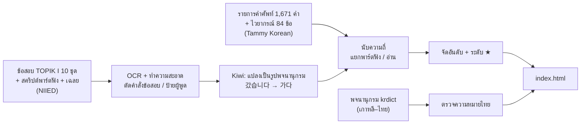

# 🐍 koreasnakefish — TOPIK I

เว็บเตรียมสอบ **TOPIK I** (ระดับ 1–2) สำหรับคนไทย
เรียนคำศัพท์และไวยากรณ์ **ตามลำดับที่ออกสอบบ่อยที่สุด** โดยวิเคราะห์จากข้อสอบจริง 10 ชุด

🌐 **เว็บไซต์:** https://khuxxondee.github.io/KoreanSnekeFish/ (เร็ว ๆ นี้: www.koreasnakefish.com)

---

## ทำไมถึงสร้างเว็บนี้

รายการคำศัพท์ TOPIK I ที่หาได้ทั่วไปมี **1,671 คำ** เรียงตามตัวอักษร ทำให้ไม่รู้ว่าควรจำคำไหนก่อน
แต่ในความเป็นจริง ข้อสอบแต่ละชุดใช้คำจากรายการนี้เพียงราว **1 ใน 4** และหลายคำแทบไม่เคยออกสอบเลย

เว็บนี้จึงตอบคำถามว่า **"ถ้ามีเวลาจำกัด ควรจำอะไรก่อน"** โดย

- นับว่าคำศัพท์และไวยากรณ์แต่ละตัวออกในข้อสอบจริง **กี่ชุด กี่ครั้ง**
- จัดเป็น 4 ระดับความสำคัญ ให้เริ่มจาก ★★★ ก่อน
- มีความหมาย **ภาษาไทยและภาษาอังกฤษ** ประโยคตัวอย่างจากข้อสอบจริง และเสียงอ่าน

---

## ระดับความสำคัญ

| ระดับ | ความหมาย | เกณฑ์ (จากข้อสอบ 10 ชุด) | คำศัพท์ | ไวยากรณ์ |
|---|---|---|---|---|
| ★★★ **Must know** | ต้องรู้ | พบใน ≥ 7 ชุด | 350 | 67 |
| ★★ **Should know** | ควรจำ | พบใน 3–6 ชุด | 365 | 11 |
| ★ **Good to know** | รู้ไว้ | พบใน 1–2 ชุด | 355 | 9 |
| · **Extra** | เสริม | ไม่พบในข้อสอบที่วิเคราะห์ | 601 | 2 |

การเรียงลำดับดู **จำนวนชุดที่พบ** ก่อน แล้วค่อยดู **จำนวนครั้งรวม** เพราะคำที่ออกทุกปีสำคัญกว่าคำที่ออกเยอะแค่ปีเดียว

🎧 **Listening** = คำ/ไวยากรณ์ที่พบในพาร์ตฟังอย่างน้อย 70% (คำศัพท์ 87 คำ · ไวยากรณ์ 19 ข้อ) ควรฝึกฟังเป็นพิเศษ

---

## วิธีใช้งาน

| เมนู | ทำอะไรได้ |
|---|---|
| **Menu** | เริ่ม *Today's session*: คำใหม่ตามลำดับความสำคัญ → ทบทวนคำที่ถึงรอบ → ไวยากรณ์ 1 เรื่อง → แบบทดสอบสั้น · ดูความคืบหน้าบนเส้นจำนวน |
| **Vocabulary** | คำศัพท์เรียงจากออกสอบบ่อยที่สุด · ดูแบบ **รายการ** (แตะคำเพื่อดูความหมาย) หรือ **แฟลชการ์ด** · กรองตามระดับ / ชนิดคำ / 🎧 · ค้นหาได้ทั้ง 한국어 / English / ไทย |
| **Grammar** | ไวยากรณ์ 89 ข้อ เรียงตามความถี่ · คำอธิบายภาษาไทย · ตัวอย่างพร้อมคำแปล · ประโยคจากข้อสอบจริง |
| **Practice** | แบบฝึกหัด 4 แบบ: คำ → ความหมาย · ความหมาย → คำ · ฟังแล้วเลือก · ไวยากรณ์ |

**เคล็ดลับ**
- 🔊 กดครั้งแรก = ความเร็วปกติ · กดครั้งต่อไป = **ช้าลง** (มีป้าย "slow")
- แฟลชการ์ดใช้คีย์บอร์ดได้: `Space` พลิก · `←` `→` เลื่อน · `1` ยังจำไม่ได้ · `2` จำได้แล้ว
- คำที่ตอบผิดจะกลับมาให้ทบทวนตามรอบ (ระบบ Leitner: 0, 1, 2, 4, 7, 14 วัน)
- สลับ **Light / Dark mode** ได้ที่มุมขวาบน

> ความคืบหน้าบันทึกใน **เบราว์เซอร์ของเครื่องนั้น** (localStorage) ถ้าเปลี่ยนเครื่องหรือล้างข้อมูลเบราว์เซอร์ ความคืบหน้าจะหาย
> เสียงอ่านใช้ระบบเสียงของเครื่อง ถ้าไม่มีเสียงออก ให้ติดตั้ง **เสียงภาษาเกาหลี (Korean voice)** ในการตั้งค่าระบบ

---

## ข้อมูลมาจากไหน



1. **รายการตั้งต้น** — คำศัพท์ 1,671 คำ และไวยากรณ์ 84 ข้อ จาก Tammy Korean
2. **ข้อสอบจริง** — TOPIK I ครั้งที่ 35, 36, 37, 41, 47, 52, 60, 64, 83, 91 ที่ NIIED เผยแพร่อย่างเป็นทางการ
   - พาร์ตอ่านจากกระดาษข้อสอบ · พาร์ตฟังจากสคริปต์บทสนทนาเต็ม
   - ไฟล์ที่เป็นภาพสแกนใช้ OCR (Tesseract)
3. **วิเคราะห์ภาษา** — ใช้ [Kiwi](https://github.com/bab2min/kiwipiepy) แยกหน่วยคำ ทำให้นับรูปผันได้ถูก เช่น 갔습니다 / 가요 / 갈 นับเป็น **가다**
   - ไวยากรณ์ตรวจจับด้วยรูปแบบหน่วยคำ เช่น `-고 싶다` = `고/EC 싶/VX`
4. **ความหมายภาษาไทย** — ครบทุกคำในระดับ ★★★ และ ★★ (715 คำ) แต่ละคำเทียบกับ **ทุกความหมาย** ในพจนานุกรม krdict และมีลิงก์ไปหน้าคำนั้นให้ตรวจเอง
5. **ประโยคตัวอย่าง** — ดึงจากข้อสอบจริง (889 คำ) ขีดเส้นใต้คำศัพท์ในประโยค และแปลไทย/อังกฤษ (657 คำ)

โค้ดวิเคราะห์ (Jupyter Notebook) และข้อมูลข้อสอบ **เก็บแยกไว้ ไม่ได้อยู่ใน repository นี้** เพื่อไม่ให้ข้อสอบทั้งชุดถูกเผยแพร่

---

## โครงสร้าง repository

```
KoreanSnekeFish/
├── index.html     ← ทั้งเว็บอยู่ในไฟล์เดียว (หน้าเว็บ + โค้ด + ข้อมูล)
├── README.md      ← ไฟล์นี้
├── CREDITS.md     ← แหล่งข้อมูลและเงื่อนไขการใช้งาน
└── .gitignore     ← กันไม่ให้ไฟล์ข้อสอบ / notebook หลุดขึ้น repo นี้
```

**เทคโนโลยี:** HTML + CSS + JavaScript ล้วน ไม่มี framework ไม่ต้อง build
- ข้อมูลฝังอยู่ใน `<script id="data" type="application/json">` ภายใน `index.html`
- เสียงอ่าน: Web Speech API ของเบราว์เซอร์ (`ko-KR`)
- ฟอนต์: Inter (อังกฤษ) · Prompt (ไทย) · Gowun Dodum / Gowun Batang (เกาหลี)

---

## รันบนเครื่อง / ขึ้นเว็บ

**เปิดบนเครื่อง:** ดับเบิลคลิก `index.html` ได้เลย

**ขึ้นเว็บด้วย GitHub Pages**
1. Settings → Pages → Source: **Deploy from a branch** → `main` / `(root)` → Save
2. Custom domain: `www.koreasnakefish.com`
3. ที่ผู้ให้บริการโดเมน เพิ่ม DNS `CNAME` · Name `www` · Value `khuxxondee.github.io`
4. เมื่อ DNS ใช้ได้ ติ๊ก **Enforce HTTPS**

**อัปเดตเว็บ:** แก้ `index.html` → `git add . && git commit -m "update" && git push` (เว็บอัปเดตใน 1–2 นาที)

---

## ข้อจำกัดที่ทราบ

- ความหมายภาษาไทยของคำระดับ ★ และ · ยังไม่ครบ (แสดงเป็นภาษาอังกฤษ)
- คำระดับ ★★★/★★ บางคำยังไม่มีประโยคตัวอย่าง หรือมีแต่ยังไม่ได้แปล
- ข้อความจากข้อสอบมาจาก OCR อาจมีตัวสะกดผิดบางจุด
- คำพ้องรูปแยกความหมายไม่ได้ เช่น 눈 (ตา / หิมะ) นับรวมกัน
- คุณภาพเสียงขึ้นกับเสียงภาษาเกาหลีที่ติดตั้งในเครื่องผู้ใช้

## แผนต่อไป

- เติมความหมายไทยและประโยคตัวอย่างให้ครบ
- **TOPIK II** (แยกชุดข้อมูลจาก TOPIK I)
- ไฟล์เสียงที่บันทึกไว้ล่วงหน้า · บัญชีผู้ใช้เพื่อเก็บความคืบหน้าข้ามเครื่อง

---

## เครดิต

| แหล่งข้อมูล | ใช้ทำอะไร | สิทธิ์ |
|---|---|---|
| [Tammy Korean (learning-korean.com)](https://learning-korean.com/pdf/) | รายการคำศัพท์ 1,671 คำ + ไวยากรณ์ 84 ข้อ (ความหมายอังกฤษ, ตัวอย่างไวยากรณ์) | © Tammy Korean |
| [국립국제교육원 (NIIED) · topik.go.kr](https://www.topik.go.kr) | ข้อสอบ TOPIK I ที่เผยแพร่อย่างเป็นทางการ (สถิติความถี่ + ประโยคตัวอย่าง) | © NIIED · ใช้เพื่อการศึกษาแบบไม่แสวงหากำไร |
| [국립국어원 한국어-태국어 학습사전 (krdict)](https://krdict.korean.go.kr/tha/mainAction) | ตรวจและเรียบเรียงความหมายภาษาไทย | [CC BY-SA 2.0 KR](https://creativecommons.org/licenses/by-sa/2.0/kr/) |
| [Kiwi (kiwipiepy)](https://github.com/bab2min/kiwipiepy) | วิเคราะห์หน่วยคำภาษาเกาหลี | — |

ความหมายภาษาไทยบนเว็บนี้เผยแพร่ภายใต้ **CC BY-SA 2.0 KR** ตามเงื่อนไขของ krdict
รายละเอียดเพิ่มเติมดูที่ [CREDITS.md](CREDITS.md)

> เว็บนี้ไม่ได้มีส่วนเกี่ยวข้องกับ NIIED หรือหน่วยงานผู้จัดสอบ TOPIK
